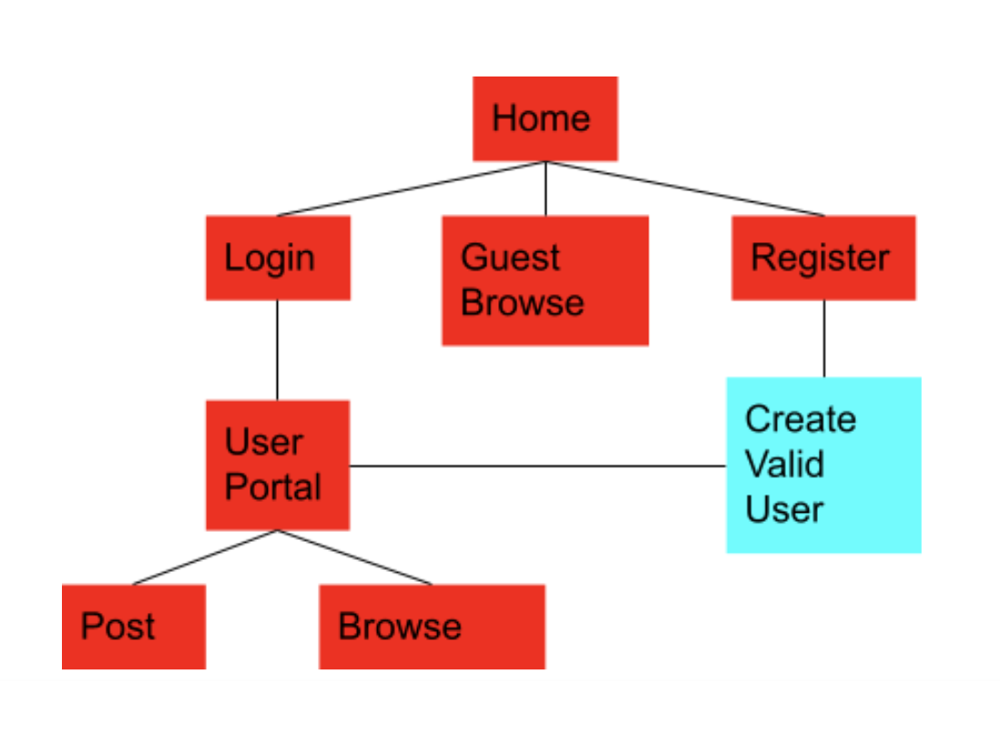

<h1>READ INSTRUCTIONS FOR UPLOADING BELOW</h1>

deployed on heroku: https://glacial-lake-10289.herokuapp.com

1. click on login/register
2. upload song
3. click on details on the home page next to post name
4. Media Player should be available and ready for playback!

<h3>For second working form</h3>
1. Search by filename! for example: song.mp3

<h2>Final Project: Voice Memo Organizer</h2>

Here I created a voice memo organizer with the ability to create comments underneath. The point of this project is to be able to label and organize memos into Posts regarding their content. 

The user should only be able to post when logged in. Otherwise they may browse. If a User wishes, they may regester for access to post audio recordings and access discussion forumn. 

